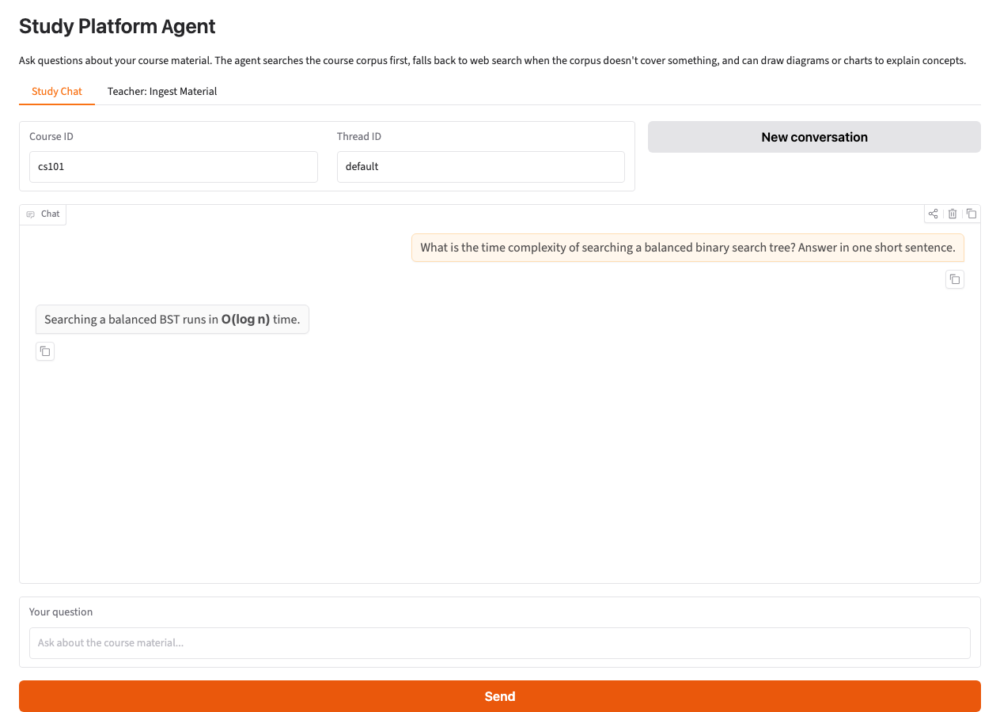
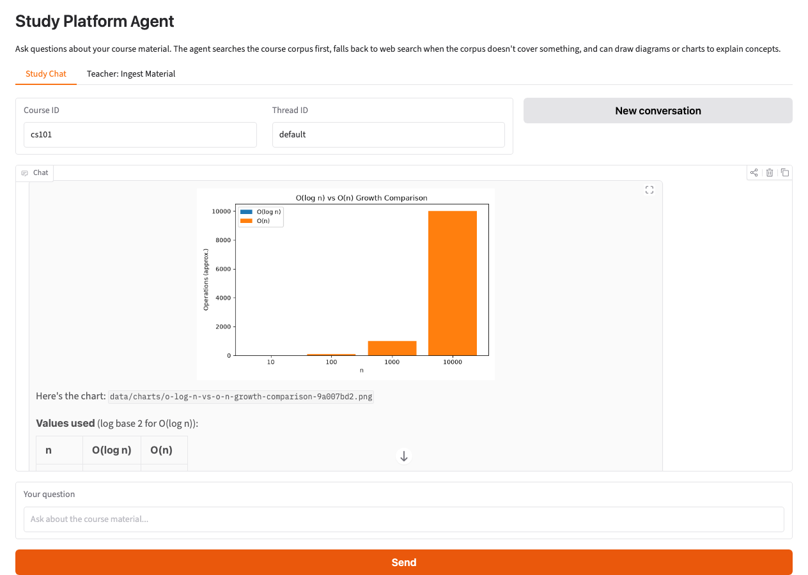
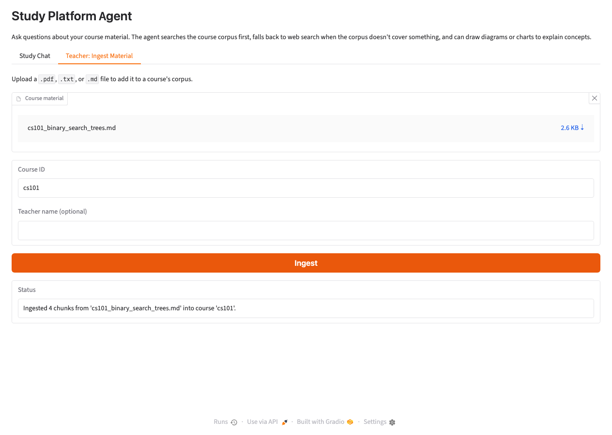

# Study Platform Agent

A LangGraph agent for a study platform: students ask questions about material
their teacher uploaded, and the agent answers using retrieval-augmented
generation over that material, falls back to web search when the material
doesn't cover something, self-corrects answers that aren't grounded, and can
generate diagrams/charts to explain concepts visually.

This project consolidates concepts from a LangGraph course (ReAct tool-calling
agents, corrective RAG, reflexion-style self-correction) into a single,
extended, real system rather than five separate exercises -- built with
Claude instead of the course's OpenAI models, plus persistence, a
configurable model, and visualization tools that weren't part of the course.

## Architecture

```
entry -> agent_reason -> should_continue? --tool_calls--> act -> agent_reason (loop)
                                          \--no tool_calls--> grade_response
grade_response --grounded & answers question--> END
grade_response --fails, retries < MAX--> agent_reason (with a critique injected)
grade_response --fails, retries >= MAX--> END (best-effort answer)
```

- **`agent_reason` <-> `act`** -- a ReAct tool-calling loop (`langgraph.prebuilt.ToolNode`).
  The agent has four tools: `search_course_materials`, `web_search`,
  `generate_diagram`, `generate_chart`.
- **`search_course_materials`** -- retrieves from a per-course Chroma
  collection, then grades each chunk's relevance with `retrieval_grader`
  before handing anything to the agent (corrective RAG). This is what lets
  the agent tell "the course doesn't cover this" apart from "I searched
  wrong," and decide to fall back to `web_search`.
- **`grade_response`** -- once the agent stops calling tools, its draft
  answer is checked for groundedness (`hallucination_grader`, against the
  whole conversation so far -- tool results *and* anything the student
  already said) and relevance (`answer_grader`). A failing answer is sent
  back to `agent_reason` with an injected critique, capped at a couple of
  retries so it can't loop forever. Implemented with LangGraph's `Command`
  API (a node picks its own next node + state update, no
  `add_conditional_edges` needed for this transition).
- **Persistence** -- `main.py` compiles the graph with a `SqliteSaver`
  checkpointer keyed by `thread_id` (`data/checkpoints.sqlite`), so a
  conversation survives restarting the CLI. `graph/graph.py`'s `app` (no
  checkpointer) is the one-off version used by tests and scripts.

## Setup

```bash
uv sync
```

`generate_diagram` renders diagrams with [Graphviz](https://graphviz.org/),
which needs its `dot` binary installed system-wide (the `graphviz` Python
package alone isn't enough):

```bash
brew install graphviz        # macOS
apt install graphviz         # Debian/Ubuntu
```

Fill in `.env` (already scaffolded with placeholders):

```
ANTHROPIC_API_KEY=...
LANGCHAIN_TRACING_V2=true
LANGCHAIN_API_KEY=...      # optional, for LangSmith tracing
LANGCHAIN_PROJECT=...
TAVILY=...                 # Tavily API key, for web_search
```

Embeddings run locally (`sentence-transformers/all-MiniLM-L6-v2`, downloaded
once on first use) -- no embeddings API key needed.

## Usage

Ingest a teacher's document into a course's corpus (a demo document already
exists at `data/sample_docs/cs101_binary_search_trees.md`):

```bash
uv run python -m ingestion.ingest --course cs101 --file data/sample_docs/cs101_binary_search_trees.md --teacher "Demo Teacher"
```

Chat with the agent:

```bash
uv run python main.py --course cs101
uv run python main.py --course cs101 --thread exam-review   # resume a named conversation
```

Optionally swap the main agent's model (default `claude-sonnet-5`; graders
always use the cheaper `claude-haiku-4-5`) to compare cost/quality yourself:

```bash
STUDY_AGENT_MODEL=claude-haiku-4-5 uv run python main.py --course cs101
```

## Web UI (Gradio)

A small [Gradio](https://www.gradio.dev/) app sits on top of the same
compiled graph as `main.py` -- same SQLite checkpoint file, so a CLI session
and a UI session on the same course/thread share history.

```bash
uv run python -m ui.app
```

This opens a local server (default `http://127.0.0.1:7860`) with two tabs:

- **Study Chat** -- set a course ID and thread ID, then chat with the agent.
  "New conversation" starts a fresh thread ID without losing past ones (press
  Enter in the Thread ID field to switch back to an old one -- its history
  reloads from the checkpoint). Charts the agent generates render inline as
  images; diagrams render as a plain code block (no live diagram rendering
  yet -- see Limitations).
- **Teacher: Ingest Material** -- upload a `.pdf`/`.txt`/`.md` file, set a
  course ID (and optionally a teacher name), and ingest it -- the same
  `ingestion.ingest.ingest()` function the CLI (`python -m ingestion.ingest`)
  and the test suite use.

| Study Chat | Chart generated inline | Teacher ingestion |
|---|---|---|
|  |  |  |

## Usage guide (end to end)

1. `uv sync`, fill in `.env`, then `uv run python -m ui.app`.
2. Open the app in your browser, go to **Teacher: Ingest Material**, upload
   `data/sample_docs/cs101_binary_search_trees.md` with course ID `cs101`,
   and click **Ingest**.
3. Switch to **Study Chat** and ask something the material covers, e.g.
   *"What is the time complexity of searching a balanced binary search
   tree?"* -- the agent answers from `search_course_materials`.
4. Ask something the material doesn't cover, e.g. *"What year was Python
   first released?"* -- the agent falls back to `web_search`.
5. Ask for a visual, e.g. *"Generate a bar chart comparing O(log n) and O(n)
   growth for n = 10, 100, 1000, 10000"* or *"Draw a diagram of how BST
   insertion works"* -- the agent calls `generate_chart`/`generate_diagram`.
6. Click **New conversation** to start a fresh thread, or press Enter in the
   Thread ID field with an earlier id to resume it (its history reloads into
   the chat window) -- history persists across UI and CLI restarts via
   `data/checkpoints.sqlite`.

## Testing

```bash
uv run pytest
```

`tests/test_chains.py` ingests the sample doc into an isolated `test-bst`
collection and exercises each grader chain against real Claude calls (no
mocking, same as the course's original tests) -- expect it to make a handful
of live API calls. `tests/test_graph.py` is a fast structural check with no
API calls.

## Project structure

```
graph/
  state.py            AgentState (MessagesState + course_id, retry_count, current_question)
  graph.py            builds the StateGraph
  persistence.py       SqliteSaver checkpointer
  nodes/
    agent.py           agent_reason node + tool binding
    grade_response.py  self-correction node
  tools/
    course_search.py   search_course_materials (retrieval + grading)
    web_search.py       Tavily
    visualize.py         generate_diagram (Graphviz) / generate_chart (matplotlib)
  chains/
    retrieval_grader.py
    hallucination_grader.py
    answer_grader.py
ingestion/
  vectorstore.py        per-course Chroma collections
  ingest.py             teacher-facing ingestion CLI
ui/
  app.py                 Gradio demo (chat + teacher ingestion tabs)
data/
  sample_docs/          tracked demo course material
  chroma/, charts/, diagrams/, checkpoints.sqlite   generated, gitignored
```

## Scope and known limitations

- **Teacher side is intentionally minimal**: ingestion is a local CLI script,
  not a web upload flow. No auth, no multi-user accounts. Generating new
  content (practice questions, study guides) for teachers is future scope.
- **Web UI is a thin demo layer**: the Gradio app (`ui/app.py`) is a
  presentation layer over the same graph, not a production frontend --
  single-process, no auth, no multi-user session isolation beyond the
  course/thread IDs typed into the form. A real frontend (FastAPI + SPA)
  would sit on top of the same graph without changing it.
- **Diagrams show as static images, not interactively**: `generate_diagram`
  renders a real PNG via Graphviz (same idea as `generate_chart`'s
  matplotlib PNGs), not an editable/zoomable diagram. An earlier version
  returned raw Mermaid text for the agent to paste into its reply, hoping
  Gradio's Chatbot (which does ship `mermaid.js`) would render it -- it
  never did for messages appended dynamically during a chat turn (confirmed
  via the browser devtools: no error, it just never ran), and the agent was
  also unreliable at copying multi-line code verbatim. Rendering to an image
  server-side sidesteps both problems.
- **LangGraph Studio (`langgraph dev`)** isn't wired up in this environment:
  its in-memory dev server needs to compile a package
  (`langgraph-runtime-inmem` -> `blockbuster` -> `forbiddenfruit`) from
  source, which a global `no-build=true` uv policy blocks here. Options if
  you want it later: allow builds in `uv.toml` and run
  `uv add "langgraph-cli[inmem]"`, or use `langgraph up` (Docker-based) via
  the existing `langgraph.json`. LangSmith tracing (already configured)
  gives full visibility into every node/tool call in the meantime.
